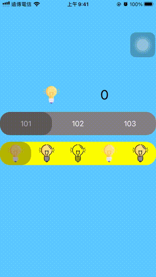

# WWSegmentControlView

[](https://developer.apple.com/swift/) [](https://developer.apple.com/swift/) [](https://developer.apple.com/swift/) [](https://developer.apple.com/swift/)

Enhanced version of UISegmentControl.
UISegmentControl的加強版.



### [Installation with Swift Package Manager](https://medium.com/彼得潘的-swift-ios-app-開發問題解答集/使用-spm-安裝第三方套件-xcode-11-新功能-2c4ffcf85b4b)
```
dependencies: [
    .package(url: "https://github.com/William-Weng/WWSegmentControlView.git", .upToNextMajor(from: "1.0.0"))
]
```


### Example
```swift
import UIKit
import WWSegmentControlView

final class ViewController: UIViewController {
    
    private enum SegmentControlViewType: Int {
        case base = 1000
        case plus = 2000
    }
    
    @IBOutlet weak var selectedLabel: UILabel!
    @IBOutlet weak var selectedImageView: UIImageView!
    @IBOutlet weak var baseSegmentControlView: WWSegmentControlView!
    @IBOutlet weak var plusSegmentControlView: WWSegmentControlView!

    private let selectedImages = [#imageLiteral(resourceName: "LightHighlight"), #imageLiteral(resourceName: "LightOn"), #imageLiteral(resourceName: "LightOff")]
    private var currentIndex: Int = 100

    override func viewDidLoad() {
        super.viewDidLoad()
        baseSegmentControlView.myDelegate = self
        plusSegmentControlView.myDelegate = self
    }
    
    override func viewDidAppear(_ animated: Bool) {
        super.viewDidAppear(animated)
        initSetting()
    }
    
    @objc func didSelectBaseButton(_ sender: UIButton) {
        baseSegmentControlView.selectedIndex(sender.tag, animated: false)
    }
    
    @objc func didSelectPlusButton(_ sender: UIButton) {
        plusSegmentControlView.selectedIndex(sender.tag, animated: true)
    }
}

// MARK: - WWSegmentControlDelegate
extension ViewController: WWSegmentControlDelegate {
    
    func willMoveSegmentControl(_ segmentControl: WWSegmentControlView, from fromIndex: Int, to toIndex: Int) {
        selectedLabel.text = "\(fromIndex) to \(toIndex)"
    }
    
    func didMovedSegmentControl(_ segmentControl: WWSegmentControlView, to index: Int) {
        
        guard let type = SegmentControlViewType.init(rawValue: segmentControl.tag) else { return }
        
        switch type {
        case .base:
            selectedLabel.text = "\(index)"
        case .plus:
            selectedLabel.text = "\(index)"
            selectedImageView.image = selectedImages[index]
        }
    }
}

// MARK: - 小工具
extension ViewController {
    
    /// 初始化設定
    func initSetting() {
        
        baseSegmentControlView.tag = SegmentControlViewType.base.rawValue
        baseSegmentControlView.selectedButton.backgroundColor = .black.withAlphaComponent(0.3)
        baseSegmentControlView.controlButtons.forEach { button in
            currentIndex += 1
            button.addTarget(self, action: #selector(didSelectBaseButton(_:)), for: .touchDown)
            button.backgroundColor = .gray
            button.setTitle("\(currentIndex)", for: .normal)
        }
        
        plusSegmentControlView.tag = SegmentControlViewType.plus.rawValue
        plusSegmentControlView.animationInfomation(start: (0.5, 0.8), end: (2.0, 0.1))
        plusSegmentControlView.selectedButton.backgroundColor = .black.withAlphaComponent(0.3)
        plusSegmentControlView.controlButtons.forEach { button in
            button.addTarget(self, action: #selector(didSelectPlusButton(_:)), for: .touchDown)
            button.backgroundColor = .yellow
            button.setTitle("", for: .normal)
            button.setImage(selectedImages[button.tag], for: .normal)
        }
    }
}

```
